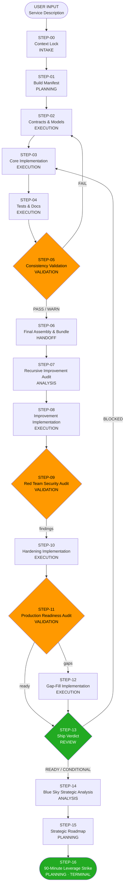

# OPTIMIZED WORKFLOW PROMPT CHAIN
## L9 Labs Microservice Build Pipeline
### `chain-of-search` · github.com/cryptoxdog/chain-of-search

---

## Chain Overview

| Attribute | Value |
|---|---|
| **Total steps** | 17 |
| **Source prompts ingested** | 11 (P-000 through P-010) |
| **Prompts decomposed** | 6 (P-000, P-004, P-005, P-006, P-007, P-010) |
| **New steps inserted** | 1 (STEP-00: Context Lock — missing INTAKE) |
| **Critical flaws resolved** | 10 |
| **Canonical data types** | 12 |
| **Workflow type** | Linear · zero branches |

---

## Canonical Data Type Definitions

```
SERVICE_CONTEXT_RECORD  :: { service_name, service_domain, service_purpose,
                              target_repo_url, l9_node_role, constellation_position,
                              stack[], constraints[] }

BUILD_MANIFEST          :: { file_tree, module_map[], public_signatures[],
                              handler_action_map[], yaml_specs[], golden_repo_deps[],
                              packet_types_emitted[], packet_types_consumed[],
                              external_systems[], build_checklist[] }

CONTRACT_ARTIFACT       :: { metadata: { version, timestamp, service_name },
                              file_tree, files: { path, content }[] }

IMPLEMENTATION_ARTIFACT :: { metadata: { version, timestamp, service_name, sha },
                              file_tree,
                              new_files: { path, content }[],
                              revised_files: { path, content }[],
                              wiring_map[] }

TEST_DOC_ARTIFACT       :: { metadata: { version, timestamp, service_name },
                              file_tree,
                              test_files: { path, content }[],
                              doc_files: { path, content }[],
                              readiness_checklist[] }

ARTIFACT_BUNDLE         :: { metadata: { version, timestamp, service_name },
                              all_files: { path, content, phase }[],
                              bundle_manifest,
                              consistency_status: PASS|FAIL|WARN }

AUDIT_REPORT            :: { findings: { id, file, risk_level: CRITICAL|HIGH|MEDIUM|LOW,
                                         description, recommended_fix }[],
                              risk_summary: { critical, high, medium, low } }

HARDENING_ARTIFACT      :: { metadata: { version, timestamp, service_name },
                              new_files: { path, content }[],
                              revised_files: { path, content }[],
                              residual_risks[] }

SHIP_VERDICT_RECORD     :: { verdict: BLOCKED|CONDITIONAL|READY,
                              blockers[], warnings[],
                              production_checklist[], deployment_notes }

STRATEGIC_ANALYSIS_RECORD :: { essence, strengths[], hidden_leverage[],
                                missed_opportunities[], evolution_paths[],
                                double_down[], simplify[],
                                l9_fit, long_term_vision }

STRATEGIC_ROADMAP       :: { vision_lock, leverage_prioritization[],
                              phases: { name, objective, capabilities[],
                                        hidden_leverage_activated[],
                                        dependencies[], risks[],
                                        milestones[], dod }[],
                              execution_order_logic }

LEVERAGE_STRIKE_RECORD  :: { selected_action,
                              execution_plan: { step, duration_min,
                                                files_touched[], expected_output }[],
                              validation_checklist[], reasoning }
```

---

## Execution Sequence

```
STEP-00  Microservice Context Lock              INTAKE       → STEP-01
STEP-01  Build Manifest Generation              PLANNING     → STEP-02
STEP-02  Contracts, Models & Spec               EXECUTION    → STEP-03
STEP-03  Core Implementation                    EXECUTION    → STEP-04
STEP-04  Tests, Docs & Ship Pack                EXECUTION    → STEP-05
STEP-05  Consistency Validation                 VALIDATION   → STEP-06 (or back to STEP-02–04)
STEP-06  Final Assembly & Bundle                HANDOFF      → STEP-07
STEP-07  Recursive Improvement Audit            ANALYSIS     → STEP-08
STEP-08  Improvement Implementation             EXECUTION    → STEP-09
STEP-09  Red Team Security Audit                VALIDATION   → STEP-10
STEP-10  Hardening Implementation               EXECUTION    → STEP-11
STEP-11  Production Readiness Audit             VALIDATION   → STEP-12
STEP-12  Gap-Fill Implementation                EXECUTION    → STEP-13
STEP-13  Ship Verdict                           REVIEW       → STEP-14
STEP-14  Blue Sky Strategic Analysis            ANALYSIS     → STEP-15
STEP-15  Strategic Roadmap                      PLANNING     → STEP-16
STEP-16  90-Minute Leverage Strike              PLANNING     → TERMINAL
```



---

## PROMPT CHAIN

---

### STEP-00 — Microservice Context Lock

**Role**: `INTAKE`
**Depends On**: USER INPUT
**Feeds**: STEP-01

```
## STEP-00 — Microservice Context Lock

### Role
INTAKE

### Objective
Capture, validate, and normalize all user-provided information about the target
microservice into a typed SERVICE_CONTEXT_RECORD that every downstream step
references. Nothing is built until this record is confirmed complete.

### Constraints
- Do not generate any files, manifests, or implementation in this step
- Do not infer service purpose, domain, or stack from context — require explicit input
- If any required field is absent or ambiguous, emit CONTEXT_ERROR listing every
  missing field and halt — do not proceed with partial context
- SERVICE_CONTEXT_RECORD is immutable after this step — no downstream step may
  alter it

### Required Inputs
| Input                    | Type               | Source        | Required |
|--------------------------|--------------------|---------------|----------|
| Service name             | string             | User-provided | Required |
| Service domain/purpose   | string             | User-provided | Required |
| L9 node role             | string             | User-provided | Required |
| Constellation position   | string             | User-provided | Required |
| Target repo URL          | string             | User-provided | Required |
| Stack                    | string[]           | User-provided | Required |
| Constraints              | string[]           | User-provided | Required |

### Execution Logic
1. Receive all user-provided inputs.
2. Validate presence and non-ambiguity of every required field.
3. If any field is absent or ambiguous: emit CONTEXT_ERROR: { missing_fields: [],
   ambiguous_fields: [] } and halt.
4. Populate SERVICE_CONTEXT_RECORD from validated inputs.
5. Emit SERVICE_CONTEXT_RECORD.

### Expected Outputs
| Output                  | Type                    | Consumer   |
|-------------------------|-------------------------|------------|
| SERVICE_CONTEXT_RECORD  | SERVICE_CONTEXT_RECORD  | All steps  |

### Failure Behavior
Any required field absent or ambiguous → CONTEXT_ERROR with field list → halt.
Do not infer missing values. Do not proceed with partial context.
```

---

### STEP-01 — Build Manifest Generation

**Role**: `PLANNING`
**Depends On**: STEP-00
**Feeds**: STEP-02

```
## STEP-01 — Build Manifest Generation

### Role
PLANNING

### Objective
Using SERVICE_CONTEXT_RECORD, generate a complete BUILD_MANIFEST that defines
every service-owned file, its purpose, public API surface, handler/action map,
packet types, external dependencies, and phased build checklist.

### Constraints
- Generate only service-owned files — do NOT include: chassis, Docker, CI/CD,
  auth, rate limiting, routing shell, metrics shell, or platform bootstrapping
  (these are owned by golden-repo)
- Assume Constellation Gate Node owns all ingress — do not design ingress logic
- All microservice integration must be declared through the L9 node contract
  and TransportPacket flow
- If a simpler design achieves the same capability, state it explicitly before
  the full manifest
- No stubs, no placeholders, no pseudocode in any declared file
- Output BUILD_MANIFEST content only — no prose commentary

### Required Inputs
| Input                   | Type                   | Source  | Required |
|-------------------------|------------------------|---------|----------|
| SERVICE_CONTEXT_RECORD  | SERVICE_CONTEXT_RECORD | STEP-00 | Required |

### Execution Logic
1. Ingest SERVICE_CONTEXT_RECORD.
2. Evaluate whether a simpler design (fewer files, tighter scope) achieves the
   declared service_purpose. If yes: state the simplified design in one paragraph
   before the manifest.
3. Derive the complete file tree for service-owned files only.
4. For each file, populate module_map entry: { path, purpose, owns[] }.
5. For each public class and function, declare exact signature:
   { name, file, signature, return_type, purpose }.
6. Map every handler to its triggering action:
   { handler_name, file, action, packet_type_in, packet_type_out }.
7. List all YAML spec files required by the service (not by golden-repo).
8. Declare all dependencies on: golden-repo exports, shared L9 contracts,
   Constellation Gate Node interfaces.
9. List all TransportPacket types emitted and consumed with field schemas.
10. List all external systems the service touches (DBs, APIs, queues, etc.).
11. Generate a phased build checklist: ordered list of completion milestones
    with done criteria per milestone.
12. Assemble and emit BUILD_MANIFEST.

### Expected Outputs
| Output         | Type           | Consumer |
|----------------|----------------|----------|
| BUILD_MANIFEST | BUILD_MANIFEST | STEP-02  |

### Failure Behavior
SERVICE_CONTEXT_RECORD missing required fields → emit MANIFEST_ERROR:
{ reason: "SERVICE_CONTEXT_RECORD incomplete" } and halt.
Scope conflict with golden-repo detected → flag the conflicting file as
GOLDEN_REPO_OWNED and exclude it from BUILD_MANIFEST.file_tree.
```

---

### STEP-02 — Contracts, Models & Spec

**Role**: `EXECUTION`
**Depends On**: STEP-01, STEP-00
**Feeds**: STEP-03

```
## STEP-02 — Contracts, Models & Spec

### Role
EXECUTION

### Objective
Generate all contract-layer files for this microservice — every Pydantic v2 model,
settings schema, payload type, spec schema, enum, type alias, YAML spec, and handler
registration surface — fully aligned with L9 and Constellation Gate compatibility.

### Constraints
- Python 3.12+ only
- snake_case for all identifiers — no aliases, no field_alias, no camelCase
- No FastAPI code of any kind
- No infra files — contract layer only
- Do not redefine types already declared in shared L9 chassis or golden-repo —
  import them; never copy-paste them
- All models must be TransportPacket compatible
- Every file must carry the L9 metadata header (see Execution Logic step 2)
- No TODO, no NotImplementedError, no placeholder values in any file
- All imports must resolve against SERVICE_CONTEXT_RECORD.stack[]
- Zero stubs — every declared class and function must have complete implementations

### Required Inputs
| Input                  | Type                   | Source  | Required |
|------------------------|------------------------|---------|----------|
| BUILD_MANIFEST         | BUILD_MANIFEST         | STEP-01 | Required |
| SERVICE_CONTEXT_RECORD | SERVICE_CONTEXT_RECORD | STEP-00 | Required |

### Execution Logic
1. Ingest BUILD_MANIFEST and SERVICE_CONTEXT_RECORD.
2. Apply the L9 metadata header to every generated file:
   ```python
   # service: {SERVICE_CONTEXT_RECORD.service_name}
   # layer: contracts
   # version: 1.0.0
   # l9-node-role: {SERVICE_CONTEXT_RECORD.l9_node_role}
   # constellation: {SERVICE_CONTEXT_RECORD.constellation_position}
   ```
3. Generate in this order (resolve dependencies before dependents):
   a. Enums and type aliases
   b. Base model classes (if needed)
   c. Domain Pydantic v2 models
   d. Typed payload / request / response models
   e. Settings / config schema (pydantic-settings, env-sourced)
   f. Spec schema + loader (load from YAML, validate on startup)
   g. YAML spec file(s) (complete, valid YAML — no placeholder values)
   h. Handler registration surface (typed handler signatures only — no logic)
4. Verify every import in every file resolves against: standard library,
   SERVICE_CONTEXT_RECORD.stack[], or explicitly declared L9 shared imports.
5. Verify no type defined here duplicates a type from L9 shared contracts.
6. Assemble CONTRACT_ARTIFACT: populate file_tree, files[].
7. Set metadata: { version: "1.0", timestamp: <ISO8601>,
   service_name: SERVICE_CONTEXT_RECORD.service_name }.
8. Emit CONTRACT_ARTIFACT.

### Expected Outputs
| Output            | Type              | Consumer |
|-------------------|-------------------|----------|
| CONTRACT_ARTIFACT | CONTRACT_ARTIFACT | STEP-03  |

### Output Format
Emit exactly:
1. File tree for Phase 2 (contract layer) files
2. Complete contents of every file
Nothing else.

### Failure Behavior
Import unresolvable → flag file as IMPORT_UNRESOLVED, exclude from artifact,
log the specific import path. Do not emit files with unresolvable imports.
Duplicate type detected → emit DUPLICATE_TYPE_ERROR: { type_name, existing_source }
and halt rather than silently shadow an L9 shared type.
```

---

### STEP-03 — Core Implementation

**Role**: `EXECUTION`
**Depends On**: STEP-02, STEP-01, STEP-00
**Feeds**: STEP-04

```
## STEP-03 — Core Implementation

### Role
EXECUTION

### Objective
Generate the complete core implementation of the microservice — every service-owned
logic file wired into a real execution path — using CONTRACT_ARTIFACT as the
authoritative type surface.

### Scope
Generate only service-owned core files. Include as required by BUILD_MANIFEST:
- handlers bridge
- config loader / settings initializer
- gates (access, capability, domain)
- scoring logic
- traversal logic
- sync logic
- graph / DB wrappers
- compliance checks
- packet bridge (TransportPacket in/out)
- service utilities
- domain execution logic

### Constraints
- Do NOT generate: chassis, gateway, infra, Docker, CI, auth, rate limiting,
  tenant resolution, logging config, metrics shell, or platform bootstrapping —
  these are golden-repo owned
- All integration with Constellation Gate Node must go through the L9 node contract
- All external communication must be TransportPacket-safe; never bypass the envelope
- Parameterize all database and query values — no string interpolation in queries
- Raise explicit named exceptions only — no bare `except Exception`, no `pass`
- Use structured logging only (e.g., structlog or equivalent) — no print, no bare
  logging.info without structured fields
- All external I/O operations must be async
- Zero stubs — every function must have a complete implementation
- Zero dead files — every file must be reachable from a real execution path
- Every file must carry the L9 metadata header (layer: core)
- Preserve and extend CONTRACT_ARTIFACT — no regression against contract types

### Required Inputs
| Input                  | Type                   | Source  | Required |
|------------------------|------------------------|---------|----------|
| CONTRACT_ARTIFACT      | CONTRACT_ARTIFACT      | STEP-02 | Required |
| BUILD_MANIFEST         | BUILD_MANIFEST         | STEP-01 | Required |
| SERVICE_CONTEXT_RECORD | SERVICE_CONTEXT_RECORD | STEP-00 | Required |

### Execution Logic
1. Ingest all three inputs.
2. Resolve the implementation order from BUILD_MANIFEST.build_checklist[] —
   implement foundational utilities before logic that depends on them.
3. For each file in BUILD_MANIFEST.file_tree that is a core (non-contract) file:
   a. Implement it completely against CONTRACT_ARTIFACT types.
   b. Apply the L9 metadata header (layer: core).
   c. Verify all imports resolve.
   d. Verify the file is called from at least one other file in the service.
4. Populate wiring_map[]: for each file, list its callers and callees within
   the service boundary.
5. Set metadata: { version: "2.0", timestamp: <ISO8601>,
   service_name: SERVICE_CONTEXT_RECORD.service_name,
   sha: <current build state identifier> }.
6. Emit IMPLEMENTATION_ARTIFACT (v1).

### Expected Outputs
| Output                      | Type                    | Consumer |
|-----------------------------|-------------------------|----------|
| IMPLEMENTATION_ARTIFACT(v1) | IMPLEMENTATION_ARTIFACT | STEP-04  |

### Output Format
Emit exactly:
1. Phase 3 file tree
2. Complete contents of every file
Nothing else.

### Failure Behavior
File unreachable from any execution path → emit DEAD_FILE_ERROR: { path } and
exclude the file. Do not emit dead files.
Import unresolvable → same handling as STEP-02.
Regression against CONTRACT_ARTIFACT type (redefines or narrows a contract type)
→ emit REGRESSION_ERROR: { type, file } and halt.
```

---

### STEP-04 — Tests, Docs & Ship Pack

**Role**: `EXECUTION`
**Depends On**: STEP-03, STEP-02, STEP-01, STEP-00
**Feeds**: STEP-05

```
## STEP-04 — Tests, Docs & Ship Pack

### Role
EXECUTION

### Objective
Generate the complete test suite, all documentation artifacts, and supporting
operational files for the microservice, producing a TEST_DOC_ARTIFACT ready for
consistency validation.

### Scope
Generate:
- Full pytest suite covering all public functions in IMPLEMENTATION_ARTIFACT(v1)
- Integration tests for every handler and packet flow
- Compliance and security tests for contract enforcement and input validation
- README.md (service overview, setup, usage, contracts, integration guide)
- Runbook (operational notes, failure playbook, observability guide)
- llms.txt (machine-readable service summary for LLM consumption) — generate
  this file unconditionally; it is not optional
- Final service index / manifest (human-readable summary of all files and roles)

### Constraints
- Do NOT generate infra files
- No placeholder tests — every test must assert a real, specific behavior
- No fake tests — every test must be capable of failing when the code is broken
- No pseudocode — all test code must be executable
- Test coverage must include: all critical public functions, all failure paths,
  all TransportPacket in/out flows, all validation boundaries
- Every test file must carry the L9 metadata header (layer: tests)
- Every doc file must carry the L9 metadata header (layer: docs)
- README.md must include: service purpose, prerequisites, environment variables,
  startup sequence, handler/action map, packet types, integration points,
  known limitations
- Runbook must include: startup checklist, health check procedure, failure
  scenarios with remediation steps, log query patterns, escalation path
- llms.txt must include: service name, domain, l9_node_role, packet_types_emitted[],
  packet_types_consumed[], external_systems[], public_handler_map[]

### Required Inputs
| Input                       | Type                    | Source  | Required |
|-----------------------------|-------------------------|---------|----------|
| IMPLEMENTATION_ARTIFACT(v1) | IMPLEMENTATION_ARTIFACT | STEP-03 | Required |
| CONTRACT_ARTIFACT           | CONTRACT_ARTIFACT       | STEP-02 | Required |
| BUILD_MANIFEST              | BUILD_MANIFEST          | STEP-01 | Required |
| SERVICE_CONTEXT_RECORD      | SERVICE_CONTEXT_RECORD  | STEP-00 | Required |

### Execution Logic
1. Ingest all four inputs.
2. For each public function and handler in IMPLEMENTATION_ARTIFACT(v1), generate:
   a. At least one happy-path test
   b. At least one failure-path test covering invalid input or upstream error
   c. One TransportPacket boundary test (valid envelope in → valid envelope out)
3. Generate integration tests for every end-to-end handler flow defined in
   BUILD_MANIFEST.handler_action_map[].
4. Generate compliance tests verifying: contract type enforcement, input validation
   bounds, rejection of malformed TransportPackets.
5. Generate README.md, runbook, llms.txt, and final service index per constraints.
6. Embed the readiness_checklist in the final service index:
   ordered list of criteria that must be true for the service to be shippable.
7. Assemble TEST_DOC_ARTIFACT: populate file_tree, test_files[], doc_files[],
   readiness_checklist[].
8. Set metadata: { version: "3.0", timestamp: <ISO8601>,
   service_name: SERVICE_CONTEXT_RECORD.service_name }.
9. Emit TEST_DOC_ARTIFACT.

### Expected Outputs
| Output            | Type              | Consumer |
|-------------------|-------------------|----------|
| TEST_DOC_ARTIFACT | TEST_DOC_ARTIFACT | STEP-05  |

### Output Format
Emit exactly:
1. Final service file tree (contracts + core + tests + docs combined)
2. Complete contents of every remaining file
Nothing else.

### Failure Behavior
A public function in IMPLEMENTATION_ARTIFACT(v1) has zero test coverage →
emit COVERAGE_GAP: { function, file } as a warning; do not halt; record in
TEST_DOC_ARTIFACT.readiness_checklist[] as an open item.
```

---

### STEP-05 — Consistency Validation

**Role**: `VALIDATION`
**Depends On**: STEP-04, STEP-03, STEP-02, STEP-01, STEP-00
**Feeds**: STEP-06 (on PASS/WARN) or STEP-02 (on FAIL)

```
## STEP-05 — Consistency Validation

### Role
VALIDATION

### Objective
Validate the full set of generated artifacts (CONTRACT_ARTIFACT,
IMPLEMENTATION_ARTIFACT(v1), TEST_DOC_ARTIFACT) for internal consistency,
import integrity, golden-repo boundary compliance, and L9 architecture conformance
before assembly.

### Constraints
- Do not modify any files — report compliance status only
- A FAIL on any CRITICAL check returns control to the earliest affected step
- A WARN does not halt but must be recorded in every check entry
- Maximum 2 FAIL→re-entry cycles before emitting VALIDATION_ESCALATION flag
  and advancing with documented blockers

### Required Inputs
| Input                       | Type                    | Source  | Required |
|-----------------------------|-------------------------|---------|----------|
| TEST_DOC_ARTIFACT           | TEST_DOC_ARTIFACT       | STEP-04 | Required |
| IMPLEMENTATION_ARTIFACT(v1) | IMPLEMENTATION_ARTIFACT | STEP-03 | Required |
| CONTRACT_ARTIFACT           | CONTRACT_ARTIFACT       | STEP-02 | Required |
| BUILD_MANIFEST              | BUILD_MANIFEST          | STEP-01 | Required |
| SERVICE_CONTEXT_RECORD      | SERVICE_CONTEXT_RECORD  | STEP-00 | Required |

### Execution Logic
Run every check below across all artifacts. Record each as PASS / FAIL / WARN:

C1  Import Resolution         All imports in all files resolve against
                               SERVICE_CONTEXT_RECORD.stack[] or declared
                               L9 shared imports                          → PASS/FAIL
C2  Golden-Repo Boundary      No file in any artifact overlaps with
                               BUILD_MANIFEST.golden_repo_deps[] ownership → PASS/FAIL
C3  No Stubs or TODOs         No file contains stub functions, TODO
                               comments, or placeholder values             → PASS/FAIL
C4  Async I/O Compliance      All external I/O operations are async        → PASS/FAIL
C5  TransportPacket Safety     All inter-node calls use TransportPacket;
                               no raw payloads cross node boundaries       → PASS/FAIL
C6  Wiring Completeness       Every file in all artifacts is reachable
                               from a real execution path per wiring_map[] → PASS/FAIL
C7  Type Consistency          No type in IMPLEMENTATION_ARTIFACT regresses
                               or shadows a type in CONTRACT_ARTIFACT      → PASS/FAIL
C8  Test Coverage             Every public function has ≥1 test in
                               TEST_DOC_ARTIFACT.test_files[]              → PASS/WARN
C9  L9 Metadata Headers       Every file carries the correct L9 metadata
                               header with matching layer tag              → PASS/WARN
C10 Scope Compliance          No artifact contains infra, gateway, auth,
                               or chassis code                            → PASS/FAIL

Set overall status:
- Any C1–C7 or C10 FAIL → status: FAIL → return to earliest affected step
- All CRITICAL checks pass, any C8–C9 WARN → status: WARN → advance
- All checks PASS → status: PASS → advance

Emit ARTIFACT_BUNDLE with consistency_status set.

### Expected Outputs
| Output         | Type           | Consumer                    |
|----------------|----------------|-----------------------------|
| ARTIFACT_BUNDLE| ARTIFACT_BUNDLE| STEP-06 (on PASS/WARN)      |
|                |                | STEP-02 (on FAIL, re-entry) |

### Failure Behavior
Any artifact absent → emit VALIDATION_ERROR: { reason: "artifact missing",
artifact: <name> } and halt.
```

---

### STEP-06 — Final Assembly & Bundle

**Role**: `HANDOFF`
**Depends On**: STEP-05
**Feeds**: STEP-07

```
## STEP-06 — Final Assembly & Bundle

### Role
HANDOFF

### Objective
Merge all validated phase artifacts into one internally consistent ARTIFACT_BUNDLE,
produce the final unified file tree, resolve any remaining path or import collisions,
and emit the complete consolidated microservice package.

### Constraints
- Include only service-owned files — no golden-repo infra
- No new logic — assembly and path resolution only
- All file paths must be internally consistent (no duplicate paths, no orphaned
  references)
- bundle_manifest must list every file with: path, phase of origin, and role
- If any import collision or path inconsistency is detected: resolve it
  deterministically (later phase wins for revised files) and log the resolution

### Required Inputs
| Input          | Type           | Source  | Required |
|----------------|----------------|---------|----------|
| ARTIFACT_BUNDLE| ARTIFACT_BUNDLE| STEP-05 | Required |

### Execution Logic
1. Ingest ARTIFACT_BUNDLE.all_files[].
2. Detect and resolve duplicate paths: where the same path appears in multiple
   phases, retain the highest-version file and log the resolution.
3. Detect and resolve import collisions: any import that references a path that
   changed during assembly.
4. Rebuild the unified file_tree from the resolved file set.
5. Generate bundle_manifest: for each file, record { path, phase, role, sha256 }.
6. Set ARTIFACT_BUNDLE.consistency_status to PASS (assembly clean) or WARN
   (resolutions applied — logged).
7. Update ARTIFACT_BUNDLE.metadata: { version: "4.0", timestamp: <ISO8601> }.
8. Emit final ARTIFACT_BUNDLE.

### Expected Outputs
| Output                   | Type           | Consumer |
|--------------------------|----------------|----------|
| ARTIFACT_BUNDLE (final)  | ARTIFACT_BUNDLE| STEP-07  |

### Output Format
Emit exactly:
1. Final full file tree
2. Complete contents of every file (ordered by phase)
3. bundle_manifest
Nothing else — no commentary.

### Failure Behavior
Unresolvable path collision (two files claim the same path with conflicting
contracts) → emit ASSEMBLY_CONFLICT: { path, conflicting_phases } and halt
for manual resolution before proceeding.
```

---

### STEP-07 — Recursive Improvement Audit

**Role**: `ANALYSIS`
**Depends On**: STEP-06
**Feeds**: STEP-08

```
## STEP-07 — Recursive Improvement Audit

### Role
ANALYSIS

### Objective
Pressure-test the assembled ARTIFACT_BUNDLE for anything still missing, weak,
incomplete, suboptimal, under-leveraged, or not yet fully production-grade.
Produce a structured AUDIT_REPORT with file-level findings only.

### Constraints
- Do not modify any files — analysis and findings only
- Every finding must map to a specific file and line range where applicable
- No generic advice — every finding must be concrete, actionable, and file-level
- Rank findings by impact: CRITICAL, HIGH, MEDIUM, LOW
- Stay within approved architecture — do not propose infra changes or golden-repo
  responsibilities
- This step produces findings only; STEP-08 implements the fixes

### Required Inputs
| Input                    | Type           | Source  | Required |
|--------------------------|----------------|---------|----------|
| ARTIFACT_BUNDLE (final)  | ARTIFACT_BUNDLE| STEP-06 | Required |

### Execution Logic
Evaluate the entire ARTIFACT_BUNDLE against the following audit questions:

1. Missing files: are any files required by BUILD_MANIFEST.module_map[] absent?
2. Thin files: are any files too sparse to be production-useful (e.g., <10 lines
   of logic, single-function files that could be consolidated)?
3. Better patterns: do any implementations use inferior patterns when a superior
   pattern exists within the same architecture?
4. High-leverage small changes: what changes of ≤20 lines would create outsized
   reliability or capability gains?
5. Cleaner/more deterministic: what would make any function or handler more
   deterministic, idempotent, or side-effect-free?
6. Reusability: what logic is duplicated across files that could be extracted into
   a shared utility within the service boundary?
7. Overlooked items: what was likely missed in earlier phases (e.g., missing
   error codes, undeclared packet fields, incomplete YAML specs)?
8. Final upgrades: what changes would move specific files from solid to exceptional?

For each finding, record:
{ id, file, line_range (if applicable), risk_level, description, recommended_fix }

Group findings by risk_level descending.
Emit AUDIT_REPORT.

### Expected Outputs
| Output       | Type         | Consumer |
|--------------|--------------|----------|
| AUDIT_REPORT | AUDIT_REPORT | STEP-08  |

### Failure Behavior
ARTIFACT_BUNDLE absent or consistency_status == FAIL → emit AUDIT_BLOCKED:
{ reason: "bundle not ready for audit" } and return control to STEP-05.
```

---

### STEP-08 — Improvement Implementation

**Role**: `EXECUTION`
**Depends On**: STEP-07, STEP-06
**Feeds**: STEP-09

```
## STEP-08 — Improvement Implementation

### Role
EXECUTION

### Objective
Implement all CRITICAL and HIGH findings from AUDIT_REPORT as targeted, additive,
non-breaking changes to ARTIFACT_BUNDLE, producing a revised IMPLEMENTATION_ARTIFACT
containing only changed and new files.

### Constraints
- Implement only findings with risk_level CRITICAL or HIGH — MEDIUM and LOW are
  deferred unless explicitly promoted
- Every change must map to a specific AUDIT_REPORT.findings[].id
- No scope expansion beyond the finding — implement the recommended_fix only
- No architecture changes — stay within the same file structure and contracts
- No infra files — service boundary only
- All constraints from STEP-03 apply to every revised file
- Regression check: every revised file must not break the contract surface
  defined in CONTRACT_ARTIFACT
- Set metadata.version: "5.0"; record which finding IDs were addressed

### Required Inputs
| Input                   | Type           | Source  | Required |
|-------------------------|----------------|---------|----------|
| AUDIT_REPORT            | AUDIT_REPORT   | STEP-07 | Required |
| ARTIFACT_BUNDLE (final) | ARTIFACT_BUNDLE| STEP-06 | Required |

### Execution Logic
1. Ingest AUDIT_REPORT and ARTIFACT_BUNDLE.
2. Filter findings to CRITICAL and HIGH only.
3. For each finding (sorted by risk_level then id):
   a. Locate the target file in ARTIFACT_BUNDLE.all_files[].
   b. Apply the recommended_fix as a minimal, targeted change.
   c. Verify the change does not regress any type in CONTRACT_ARTIFACT.
   d. Verify all imports still resolve.
   e. Record the finding ID in the file's change log.
4. For any finding that requires a new file: create the file with full
   implementation, L9 metadata header, and wiring into at least one existing
   execution path.
5. Assemble IMPLEMENTATION_ARTIFACT(v2): new_files[] (new only),
   revised_files[] (changed only), metadata.findings_addressed[].
6. Emit IMPLEMENTATION_ARTIFACT(v2).

### Expected Outputs
| Output                      | Type                    | Consumer |
|-----------------------------|-------------------------|----------|
| IMPLEMENTATION_ARTIFACT(v2) | IMPLEMENTATION_ARTIFACT | STEP-09  |

### Failure Behavior
Finding recommended_fix requires architecture change → emit SCOPE_VIOLATION:
{ finding_id, reason } and skip that finding; document in residual notes.
Regression detected → emit REGRESSION_DETECTED: { file, finding_id } and halt
before emitting. Do not emit a regressing artifact.
```

---

### STEP-09 — Red Team Security Audit

**Role**: `VALIDATION`
**Depends On**: STEP-08, STEP-06
**Feeds**: STEP-10

```
## STEP-09 — Red Team Security Audit

### Role
VALIDATION

### Objective
Perform a comprehensive red-team audit of the microservice package, assuming
imminent deployment into a hostile, failure-prone production environment. Produce
a structured AUDIT_REPORT focused exclusively on security, safety, and resilience
risks. This step produces findings only — STEP-10 implements fixes.

### Constraints
- Do not modify any files — findings and risk assessment only
- Every finding must be concrete, file-level, and map to a specific risk category
- No generic security advice — every finding must identify the exact file,
  function, or config entry that introduces the risk
- Stay within service boundary — do not flag golden-repo responsibilities

### Required Inputs
| Input                       | Type                    | Source  | Required |
|-----------------------------|-------------------------|---------|----------|
| IMPLEMENTATION_ARTIFACT(v2) | IMPLEMENTATION_ARTIFACT | STEP-08 | Required |
| ARTIFACT_BUNDLE (final)     | ARTIFACT_BUNDLE         | STEP-06 | Required |

### Red-Team Checklist
Evaluate every file against every item:

R01  Injection risks: are any inputs used in queries, commands, or eval
     without parameterization or sanitization?
R02  Unsafe config/env: are any environment variables used without defaults
     or validation?
R03  Bad defaults: are any default values insecure (empty strings, open
     permissions, disabled validation flags)?
R04  Weak validation: are any input fields accepted without type, range, or
     format validation?
R05  Unbounded inputs: are any list, string, or numeric inputs accepted
     without size or cardinality limits?
R06  Schema drift: can any YAML spec or Pydantic model accept unknown extra
     fields without rejection?
R07  Broken trust boundaries: does any function accept data from an external
     source without first validating it against CONTRACT_ARTIFACT types?
R08  Packet misuse: is any TransportPacket bypassed, unwrapped early, or
     re-wrapped without re-validation?
R09  Silent failure paths: are there any exception handlers that swallow
     errors without logging or re-raising?
R10  Weak logging / audit gaps: are there any state transitions, access
     decisions, or packet emissions without structured log entries?
R11  Race / retry / idempotency: are there any operations that are not
     idempotent under retry conditions?
R12  Privilege or data leakage: can any error message or log entry expose
     internal state, credentials, or sensitive payload fields?
R13  Replay / duplication hazards: can the same packet be processed twice
     without detection?
R14  Dangerous error exposure: are raw exception tracebacks or internal
     error details returned in packet responses?
R15  Brittle integrations: are there any hard-coded endpoints, timeouts,
     or retry counts that should be configurable?
R16  Weak tests: are there tests that would pass even if the underlying
     code is broken (no meaningful assertions)?

### Execution Logic
1. Evaluate every file in IMPLEMENTATION_ARTIFACT(v2) and ARTIFACT_BUNDLE
   against the 16 checklist items above.
2. For each detected risk, record: { id, file, line_range, risk_level,
   risk_category (R01–R16), description, recommended_fix }.
3. Sort findings by risk_level descending.
4. Emit AUDIT_REPORT (security).

### Expected Outputs
| Output                     | Type         | Consumer |
|----------------------------|--------------|----------|
| AUDIT_REPORT (security)    | AUDIT_REPORT | STEP-10  |

### Failure Behavior
Artifacts absent → emit AUDIT_BLOCKED and halt.
```

---

### STEP-10 — Hardening Implementation

**Role**: `EXECUTION`
**Depends On**: STEP-09, STEP-08, STEP-06
**Feeds**: STEP-11

```
## STEP-10 — Hardening Implementation

### Role
EXECUTION

### Objective
Implement targeted hardening changes for all CRITICAL and HIGH security findings
from AUDIT_REPORT (security), producing a HARDENING_ARTIFACT that contains only
new and revised files.

### Constraints
- Address only CRITICAL and HIGH findings from AUDIT_REPORT (security)
- Every change must map to a specific AUDIT_REPORT finding ID
- No architecture redesign — surgical, additive fixes only
- No infra files — service boundary only
- All constraints from STEP-03 apply to every revised file
- Regression check: no hardening change may break CONTRACT_ARTIFACT type surface
- Set metadata.version: "6.0"; record findings_addressed[]
- Document residual_risks[]: findings that could not be addressed within
  the architecture boundary (e.g., require infra-level controls)

### Required Inputs
| Input                       | Type                    | Source  | Required |
|-----------------------------|-------------------------|---------|----------|
| AUDIT_REPORT (security)     | AUDIT_REPORT            | STEP-09 | Required |
| IMPLEMENTATION_ARTIFACT(v2) | IMPLEMENTATION_ARTIFACT | STEP-08 | Required |
| ARTIFACT_BUNDLE (final)     | ARTIFACT_BUNDLE         | STEP-06 | Required |

### Execution Logic
1. Ingest all three inputs.
2. Filter to CRITICAL and HIGH findings.
3. For each finding, apply the recommended_fix as a targeted surgical change.
4. For findings requiring new files (e.g., a validator module, an idempotency
   store wrapper): create the file with full implementation and wiring.
5. Compile residual_risks[]: findings that cannot be addressed without
   architecture changes or infra-level controls.
6. Assemble HARDENING_ARTIFACT: new_files[], revised_files[],
   metadata.findings_addressed[], residual_risks[].
7. Emit HARDENING_ARTIFACT.

### Expected Outputs
| Output              | Type                | Consumer |
|---------------------|---------------------|----------|
| HARDENING_ARTIFACT  | HARDENING_ARTIFACT  | STEP-11  |

### Failure Behavior
Finding fix requires architecture change → emit SCOPE_VIOLATION: { finding_id }
and add to residual_risks[]. Continue with remaining findings.
Regression detected → emit REGRESSION_DETECTED: { file, finding_id } and halt.
```

---

### STEP-11 — Production Readiness Audit

**Role**: `VALIDATION`
**Depends On**: STEP-10, STEP-06, STEP-00
**Feeds**: STEP-12 (gaps found) or STEP-13 (no blockers)

```
## STEP-11 — Production Readiness Audit

### Role
VALIDATION

### Objective
Perform a comprehensive production readiness audit of the hardened microservice
package. Determine whether the service is actually shippable — not just complete
on paper — and emit a structured AUDIT_REPORT (readiness) that identifies every
deployment blocker and missing component.

### Constraints
- Do not modify files — audit only
- Every finding must be concrete and file-level
- "Deployment blocker" means: the service will fail or behave unsafely on first
  deploy if this item is not addressed
- Do not audit golden-repo responsibilities

### Required Inputs
| Input                    | Type                | Source  | Required |
|--------------------------|---------------------|---------|----------|
| HARDENING_ARTIFACT       | HARDENING_ARTIFACT  | STEP-10 | Required |
| ARTIFACT_BUNDLE (final)  | ARTIFACT_BUNDLE     | STEP-06 | Required |
| SERVICE_CONTEXT_RECORD   | SERVICE_CONTEXT_RECORD | STEP-00 | Required |

### Readiness Checklist
Evaluate against every item:

D01  Startup / entrypoint logic is present and complete
D02  Config/env validation runs at startup before any request is processed
D03  All environment variables have safe, documented defaults
D04  TransportPacket validation occurs on every inbound packet before dispatch
D05  Health / readiness behavior is declared and reachable by the Gate Node
D06  Structured logging is present on all handler entry/exit points
D07  All external I/O operations have timeout configuration (not hard-coded)
D08  Retry logic is present for transient external failures where appropriate
D09  Idempotency is enforced for all mutating operations
D10  All critical handler flows have integration test coverage
D11  README.md contains complete setup and deployment instructions
D12  Runbook contains at least 3 failure scenarios with remediation steps
D13  llms.txt is present and valid
D14  Final service index / manifest is present
D15  No IMPORT_UNRESOLVED, DEAD_FILE, or REGRESSION flags remain from prior steps
D16  HARDENING_ARTIFACT.residual_risks[] are documented and acknowledged

### Execution Logic
1. Evaluate the merged package (ARTIFACT_BUNDLE + HARDENING_ARTIFACT changes)
   against all 16 checklist items.
2. Classify each item as: PASS / BLOCKER / WARN.
3. BLOCKER items must be resolved in STEP-12.
4. WARN items are logged but do not block deployment.
5. Emit AUDIT_REPORT (readiness) with:
   - findings[] for BLOCKER and WARN items
   - readiness_checklist[] (all 16 items with status)
6. If zero BLOCKER items: advance to STEP-13 directly.
7. If any BLOCKER items: advance to STEP-12.

### Expected Outputs
| Output                       | Type         | Consumer                    |
|------------------------------|--------------|-----------------------------|
| AUDIT_REPORT (readiness)     | AUDIT_REPORT | STEP-12 (if blockers exist) |
|                              |              | STEP-13 (if no blockers)    |

### Failure Behavior
Artifacts absent → emit READINESS_AUDIT_BLOCKED and halt.
```

---

### STEP-12 — Gap-Fill Implementation

**Role**: `EXECUTION`
**Depends On**: STEP-11, STEP-10, STEP-06
**Feeds**: STEP-13

```
## STEP-12 — Gap-Fill Implementation

### Role
EXECUTION

### Objective
Implement exactly the files and changes required to resolve every BLOCKER finding
from AUDIT_REPORT (readiness). Produce a final IMPLEMENTATION_ARTIFACT(v3)
containing only the new and revised files required to clear all deployment blockers.

### Constraints
- Address only BLOCKER items from AUDIT_REPORT (readiness)
- Every change must map to a specific AUDIT_REPORT finding ID (D01–D16)
- No architecture redesign — additive and surgical only
- No infra files — service boundary only
- All constraints from STEP-03 apply to every file
- Set metadata.version: "7.0"; record findings_addressed[]
- After this step, no BLOCKER items should remain

### Required Inputs
| Input                      | Type                | Source  | Required |
|----------------------------|---------------------|---------|----------|
| AUDIT_REPORT (readiness)   | AUDIT_REPORT        | STEP-11 | Required |
| HARDENING_ARTIFACT         | HARDENING_ARTIFACT  | STEP-10 | Required |
| ARTIFACT_BUNDLE (final)    | ARTIFACT_BUNDLE     | STEP-06 | Required |

### Execution Logic
1. Filter AUDIT_REPORT (readiness) findings to BLOCKER status only.
2. For each BLOCKER finding, implement the required file or change:
   a. Map the finding to the specific checklist item (D01–D16).
   b. Create new file or apply targeted change to existing file.
   c. Verify the checklist item passes after the change.
3. Assemble IMPLEMENTATION_ARTIFACT(v3): new_files[], revised_files[],
   metadata.findings_addressed[].
4. Emit IMPLEMENTATION_ARTIFACT(v3).

### Expected Outputs
| Output                      | Type                    | Consumer |
|-----------------------------|-------------------------|----------|
| IMPLEMENTATION_ARTIFACT(v3) | IMPLEMENTATION_ARTIFACT | STEP-13  |

### Failure Behavior
BLOCKER cannot be resolved without architecture change → emit SCOPE_VIOLATION
and escalate to STEP-13 with the blocker documented; STEP-13 will set
SHIP_VERDICT_RECORD.verdict: CONDITIONAL.
```

---

### STEP-13 — Ship Verdict

**Role**: `REVIEW`
**Depends On**: STEP-12 (or STEP-11 if no blockers), STEP-09, STEP-07, STEP-00
**Feeds**: STEP-14

```
## STEP-13 — Ship Verdict

### Role
REVIEW (terminal for build track)

### Objective
Perform a final coherence gate across the entire microservice build. Emit a typed
SHIP_VERDICT_RECORD with a deterministic verdict: READY, CONDITIONAL, or BLOCKED.

### Constraints
- Do not generate new code — review and verdict only
- Every open item from prior audits must be accounted for: either resolved,
  documented as residual, or escalated as a blocker
- The verdict must be deterministic: READY if zero open blockers; CONDITIONAL if
  residual_risks[] exist but no deployment blockers remain; BLOCKED if any
  unresolved BLOCKER items remain
- No prose hedging — verdict is exactly one of: READY / CONDITIONAL / BLOCKED

### Required Inputs
| Input                       | Type                    | Source          | Required |
|-----------------------------|-------------------------|-----------------|----------|
| IMPLEMENTATION_ARTIFACT(v3) | IMPLEMENTATION_ARTIFACT | STEP-12         | Required |
| AUDIT_REPORT (readiness)    | AUDIT_REPORT            | STEP-11         | Required |
| HARDENING_ARTIFACT          | HARDENING_ARTIFACT      | STEP-10         | Required |
| AUDIT_REPORT (security)     | AUDIT_REPORT            | STEP-09         | Required |
| AUDIT_REPORT (improvement)  | AUDIT_REPORT            | STEP-07         | Required |
| SERVICE_CONTEXT_RECORD      | SERVICE_CONTEXT_RECORD  | STEP-00         | Required |

### Execution Logic
1. Compile the unified open items list from all three AUDIT_REPORTs.
2. Classify each open item: RESOLVED (addressed in STEP-08/10/12),
   RESIDUAL (documented, acknowledged, not blocking), BLOCKER (unresolved).
3. Determine verdict:
   - Zero BLOCKER items, zero RESIDUAL items → READY
   - Zero BLOCKER items, RESIDUAL items exist → CONDITIONAL
   - Any BLOCKER items remain → BLOCKED (return to STEP-03 for major issues
     or STEP-12 for targeted fixes)
4. Build production_checklist[]: ordered list of steps required to deploy,
   derived from STEP-04 readiness_checklist[] updated with all resolved items.
5. Write deployment_notes: 3–5 sentences describing operational prerequisites,
   integration requirements, and known limitations.
6. Emit SHIP_VERDICT_RECORD.

### Expected Outputs
| Output              | Type                | Consumer |
|---------------------|---------------------|----------|
| SHIP_VERDICT_RECORD | SHIP_VERDICT_RECORD | STEP-14  |

### Failure Behavior
Any required input absent → emit VERDICT_BLOCKED: { reason: "required input
missing", artifact: <name> } and halt.
```

---

### STEP-14 — Blue Sky Strategic Analysis

**Role**: `ANALYSIS`
**Depends On**: STEP-13, STEP-00
**Feeds**: STEP-15

```
## STEP-14 — Blue Sky Strategic Analysis

### Role
ANALYSIS

### Objective
Perform a high-level strategic analysis of the microservice beyond its current
scope. Evaluate what this project really is at its core, where its highest-leverage
expansion opportunities exist within the L9 ecosystem, and what trajectory maximizes
its long-term compounding value.

### Constraints
- No implementation — no file generation, no code snippets
- No tactical fixes — those belong in prior phases
- No drift from L9 architecture context — all analysis must be grounded in
  SERVICE_CONTEXT_RECORD and the L9 constellation model
- Focus exclusively on insight, leverage, and strategic trajectory
- All findings must be specific to THIS service — no generic architecture advice

### Required Inputs
| Input                   | Type                   | Source  | Required |
|-------------------------|------------------------|---------|----------|
| SHIP_VERDICT_RECORD     | SHIP_VERDICT_RECORD    | STEP-13 | Required |
| SERVICE_CONTEXT_RECORD  | SERVICE_CONTEXT_RECORD | STEP-00 | Required |

### Execution Logic
Analyze the following dimensions and produce a structured output for each:

1. Essence: what does this service fundamentally do at its most distilled level?
   One sentence.
2. Current strengths: what design decisions create durable leverage?
3. Hidden leverage: what capabilities are latent in the current design but not
   yet exploited?
4. Missed opportunities: what high-value capabilities were not included in scope
   but would have compounded well?
5. Highest-impact evolution paths: ordered list of expansion directions, each
   with: direction name, what it unlocks, estimated leverage multiplier.
6. Double down: what aspects of the current design should be deepened?
7. Simplify or remove: what is overbuilt or adds complexity without proportional
   value?
8. L9 fit: how does this service compound with other L9 constellation nodes?
   What feedback loops does it participate in or could create?
9. Long-term vision: if fully realized over 18–24 months, what does this service
   become and what role does it play in the L9 system?

Assemble and emit STRATEGIC_ANALYSIS_RECORD.

### Expected Outputs
| Output                    | Type                      | Consumer |
|---------------------------|---------------------------|----------|
| STRATEGIC_ANALYSIS_RECORD | STRATEGIC_ANALYSIS_RECORD | STEP-15  |

### Failure Behavior
SHIP_VERDICT_RECORD.verdict == BLOCKED → emit ANALYSIS_DEFERRED:
{ reason: "service not shippable; complete build phases before strategic analysis" }.
Proceed only when verdict is READY or CONDITIONAL.
```

---

### STEP-15 — Strategic Roadmap

**Role**: `PLANNING`
**Depends On**: STEP-14
**Feeds**: STEP-16

```
## STEP-15 — Strategic Roadmap

### Role
PLANNING

### Objective
Convert STRATEGIC_ANALYSIS_RECORD into a fully executable STRATEGIC_ROADMAP.
Do not re-analyze. Every element of the roadmap must derive directly from a named
finding in STRATEGIC_ANALYSIS_RECORD.

### Constraints
- Input: STRATEGIC_ANALYSIS_RECORD only — no re-analysis, no new ideas
- Every roadmap phase must map to a named evolution path or hidden leverage item
  from STRATEGIC_ANALYSIS_RECORD
- All action items must be atomic and agent-executable without human clarification
- No fluff, no generic strategy language
- "Agent-executable" means: a capable AI agent could execute the action item
  without asking a clarifying question

### Required Inputs
| Input                     | Type                      | Source  | Required |
|---------------------------|---------------------------|---------|----------|
| STRATEGIC_ANALYSIS_RECORD | STRATEGIC_ANALYSIS_RECORD | STEP-14 | Required |

### Execution Logic
1. Ingest STRATEGIC_ANALYSIS_RECORD.
2. Vision Lock: restate STRATEGIC_ANALYSIS_RECORD.long_term_vision as a one-sentence
   target state; define the service's target role in the L9 constellation.
3. Leverage Prioritization: rank STRATEGIC_ANALYSIS_RECORD.hidden_leverage[] and
   evolution_paths[] by: (0.6 × impact) + (0.4 × (1 / effort)). Identify which
   leverage points must be activated first to enable downstream phases.
4. For each roadmap phase (derive 3–5 phases from evolution_paths[]):
   - phase_name: aligned to the evolution path
   - objective: one sentence
   - capabilities_unlocked[]: what the service can do after this phase that it
     cannot do before
   - hidden_leverage_activated[]: which items from STRATEGIC_ANALYSIS_RECORD.
     hidden_leverage[] this phase activates
   - how_this_compounding: how this phase enables or multiplies future phases
   - dependencies[]: which prior phases or L9 nodes must be ready first
   - risks[]: top 2–3 risks for this phase
5. For each phase, define:
   - milestones[]: ordered, outcome-driven milestones
   - action_items[]: atomic, agent-executable steps per milestone
   - components_impacted[]: specific files/modules affected
   - l9_integrations[]: which L9 nodes this phase integrates with
   - validation_steps[]: how to verify the phase is complete
   - failure_conditions[]: what signals that this phase has failed
   - dod[]: measurable Definition of Done criteria
6. Write execution_order_logic: explain why this sequence maximizes compounding
   leverage rather than alternative sequences.
7. Assemble and emit STRATEGIC_ROADMAP.

### Expected Outputs
| Output            | Type              | Consumer |
|-------------------|-------------------|----------|
| STRATEGIC_ROADMAP | STRATEGIC_ROADMAP | STEP-16  |

### Failure Behavior
STRATEGIC_ANALYSIS_RECORD absent or empty → emit ROADMAP_ERROR:
{ reason: "no strategic analysis available" } and halt.
```

---

### STEP-16 — 90-Minute Leverage Strike

**Role**: `PLANNING` · `TERMINAL`
**Depends On**: All prior steps
**Feeds**: USER (TERMINAL)

```
## STEP-16 — 90-Minute Leverage Strike

### Role
PLANNING (TERMINAL)

### Objective
Synthesize all prior phase outputs and select exactly ONE highest-leverage action
to execute in the next 90 minutes. Define a time-boxed execution plan that is
immediately executable without additional clarification.

### Constraints
- Select exactly ONE action — no lists, no options, no hedging, no alternatives
- The action must be immediately executable by the user or an agent
- The action must reflect the real current system state as evidenced by prior phases
- The selection must be justified by leverage scoring, not intuition
- Time-box the plan to 90 minutes total — no step may be open-ended
- Output is the LEVERAGE_STRIKE_RECORD only — no additional commentary

### Required Inputs
| Input                    | Type                 | Source          | Required |
|--------------------------|----------------------|-----------------|----------|
| STRATEGIC_ROADMAP        | STRATEGIC_ROADMAP    | STEP-15         | Required |
| STRATEGIC_ANALYSIS_RECORD| STRATEGIC_ANALYSIS_RECORD | STEP-14    | Required |
| SHIP_VERDICT_RECORD      | SHIP_VERDICT_RECORD  | STEP-13         | Required |
| ARTIFACT_BUNDLE (final)  | ARTIFACT_BUNDLE      | STEP-06         | Required |
| SERVICE_CONTEXT_RECORD   | SERVICE_CONTEXT_RECORD | STEP-00       | Required |

### Execution Logic
1. Context Synthesis: identify the current system state from SHIP_VERDICT_RECORD,
   open items from all AUDIT_REPORTs, and Phase 1 roadmap from STRATEGIC_ROADMAP.
2. Generate candidate actions from: STRATEGIC_ROADMAP.phases.action_items[],
   STRATEGIC_ANALYSIS_RECORD.hidden_leverage[], and any open BLOCKER/RESIDUAL items.
3. Score each candidate on five axes (1–10 each):
   - Impact: how much does this move the system forward?
   - Speed: how executable is this in ≤90 minutes?
   - Dependency unlock: how many downstream actions does this enable?
   - Risk reduction: how many open risks does this close?
   - Compounding effect: how much does this multiply future work?
4. Select the top-scored candidate. No ties — if scores are equal, prefer
   higher dependency_unlock score.
5. Build LEVERAGE_STRIKE_RECORD:
   - selected_action: one sentence naming the action
   - execution_plan[]: time-boxed steps summing to ≤90 minutes, each with:
     { step_number, description, duration_min, files_touched[], expected_output }
   - validation_checklist[]: ≤5 binary checks to confirm the action succeeded
   - reasoning: 3–5 sentences explaining why this action beats all alternatives,
     tied directly to leverage score and STRATEGIC_ROADMAP.execution_order_logic
6. Emit LEVERAGE_STRIKE_RECORD.

### Expected Outputs
| Output                 | Type                   | Consumer      |
|------------------------|------------------------|---------------|
| LEVERAGE_STRIKE_RECORD | LEVERAGE_STRIKE_RECORD | USER TERMINAL |

### Output Format
Emit exactly:
1. Selected action (one sentence)
2. 90-minute execution plan (time-boxed steps)
3. Expected outcome at end of 90 minutes
4. Validation checklist
5. Reasoning
Nothing else.

### Failure Behavior
STRATEGIC_ROADMAP absent → default selected_action to: "Complete STEP-15
Strategic Roadmap before executing a leverage strike."
Any other required input absent → emit STRIKE_BLOCKED: { missing: [<list>] }.
```

---

## Chain Validation Summary

| Step | Role | Inputs Typed | Outputs Typed | Handoff Clean | Status |
|---|---|---|---|---|---|
| STEP-00 | INTAKE | ✅ | ✅ | ✅ | READY |
| STEP-01 | PLANNING | ✅ | ✅ | ✅ | READY |
| STEP-02 | EXECUTION | ✅ | ✅ | ✅ | READY |
| STEP-03 | EXECUTION | ✅ | ✅ | ✅ | READY |
| STEP-04 | EXECUTION | ✅ | ✅ | ✅ | READY |
| STEP-05 | VALIDATION | ✅ | ✅ | ✅ | READY |
| STEP-06 | HANDOFF | ✅ | ✅ | ✅ | READY |
| STEP-07 | ANALYSIS | ✅ | ✅ | ✅ | READY |
| STEP-08 | EXECUTION | ✅ | ✅ | ✅ | READY |
| STEP-09 | VALIDATION | ✅ | ✅ | ✅ | READY |
| STEP-10 | EXECUTION | ✅ | ✅ | ✅ | READY |
| STEP-11 | VALIDATION | ✅ | ✅ | ✅ | READY |
| STEP-12 | EXECUTION | ✅ | ✅ | ✅ | READY |
| STEP-13 | REVIEW | ✅ | ✅ | ✅ | READY |
| STEP-14 | ANALYSIS | ✅ | ✅ | ✅ | READY |
| STEP-15 | PLANNING | ✅ | ✅ | ✅ | READY |
| STEP-16 | PLANNING | ✅ | ✅ | ✅ | READY |

---

## Optimization Changelog

| Change | Source | Result | Reason |
|---|---|---|---|
| **ADDED** | — | STEP-00 | No INTAKE step existed — "specific microservice" was unresolved in P-000 |
| **SPLIT** | P-000 | STEP-00 + STEP-01 | INTAKE and PLANNING collapsed; context lock must precede manifest |
| **SPLIT** | P-004 | STEP-05 + STEP-06 | VALIDATION and HANDOFF are distinct operations; validation must gate assembly |
| **SPLIT** | P-005 | STEP-07 + STEP-08 | ANALYSIS (audit) and EXECUTION (improvements) are separate roles |
| **SPLIT** | P-006 | STEP-09 + STEP-10 | Red team VALIDATION and hardening EXECUTION are separate roles |
| **SPLIT** | P-007 | STEP-11 + STEP-12 + STEP-13 | Readiness audit, gap-fill, and ship verdict are three distinct operations |
| **REWRITTEN** | P-001 | STEP-02 | Removed "approved" human gate; BUILD_MANIFEST is the typed typed input |
| **REWRITTEN** | P-002 | STEP-03 | Replaced "approved manifest and Phase 1 contracts" with typed artifact inputs |
| **REWRITTEN** | P-003 | STEP-04 | Made llms.txt unconditional; added typed TEST_DOC_ARTIFACT schema |
| **REWRITTEN** | P-005 | STEP-07/08 | Separated 10-item output into audit-only (STEP-07) and implement-only (STEP-08) |
| **REWRITTEN** | P-006 | STEP-09/10 | Separated 16-item red team into audit (STEP-09) and hardening (STEP-10) with residual_risks[] |
| **REWRITTEN** | P-007 | STEP-11/12/13 | Introduced SHIP_VERDICT_RECORD with deterministic 3-way verdict |
| **REWRITTEN** | P-009 | STEP-15 | Added leverage scoring formula; "no new ideas" constraint tightened to schema-level enforcement |
| **REWRITTEN** | P-010 | STEP-16 | Formalized 5-axis leverage scoring; single-action constraint enforced structurally |
| **STANDARDIZED** | All | All steps | 12 canonical data types; "approved X" language eliminated; "prior phases" replaced with typed artifact references throughout |
