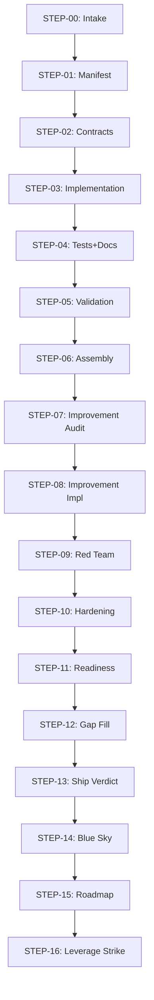

<!-- L9_META
id: new-constellation-node
version: 1.0.0
author: platform
domain: coding
use_case: Create a new L9 Constellation node from spec through registration
trigger: "new_node OR create_worker OR create_orchestrator OR scaffold_node"
skills_required: [scaffold-node]
kernels_required: [l9_coding_kernel.v1]
estimated_steps: 7
handoff_schema_version: 1.0.0
eval_status: pending
last_tested: "2026-06-17"
/L9_META -->

# PLAYBOOK: new-constellation-node

## Overview

This playbook creates a new L9 Constellation node from a typed spec through to
Gate registration and first successful health check.

**Trigger**: New node creation request with a defined node_id, action list, and domain.
**Termination**: Node registered with Gate, health endpoint returns 200, CI passes.

---

## Prerequisites

- `l9_coding_kernel.v1` active (auto-triggered by moderouter on coding objective)
- `scaffold-node` skill loaded
- `GATE_URL` environment variable set
- `constellation_node_sdk` installable in target environment

---

## Step Manifest

| Step | File | Input | Output | Skill |
|---|---|---|---|---|
| 01 | steps/01-capture-spec.md | Operator intent | NodeSpec handoff | None |
| 02 | steps/02-validate-spec.md | NodeSpec | Validated NodeSpec | None |
| 03 | steps/03-scaffold-node.md | Validated NodeSpec | Node directory | scaffold-node |
| 04 | steps/04-write-domain-logic.md | Node directory + domain spec | Implemented handlers | None |
| 05 | steps/05-run-ci.md | Implemented node | CI pass report | None |
| 06 | steps/06-register-gate.md | CI-passed node | Registration result | None |
| 07 | steps/07-verify-health.md | Registration result | Health check pass | None |

---

## Handoff Schema

Typed inter-step objects defined in `handoffs/`:
- `NodeSpec` (steps/01 → steps/02 → steps/03): node identity and capability declaration
- `ScaffoldResult` (steps/03 → steps/04): created file manifest + next steps
- `RegistrationResult` (steps/06 → steps/07): gate registration response

---

## Known Failure Modes

| Failure | Recovery |
|---|---|
| node_id already registered at Gate | Add `?overwrite=true` to registration call |
| Birth acceptance gate fails (pip install) | Check package for import-time side effects |
| CI fails on PacketEnvelope scan | Remove PacketEnvelope import — use TransportPacket |
| Health endpoint returns 503 | Check GATE_URL env var and node spec internal_url |
| handler signature wrong | Fix to `async def X(packet: TransportPacket) -> TransportPacket` |

---

## Success Criteria

1. `{node_id}/` directory exists with complete Layer 10 structure
2. `make harness` exits 0
3. `POST {GATE_URL}/v1/admin/register` returns 200
4. `GET http://{node_id}:8000/v1/health` returns `{"status": "healthy"}`

---

## Preserved non-regressive material from l9-ops-v1.2.2(3).zip::l9-ops/playbooks/microservice-build/PLAYBOOK.md

---
name: microservice-build
version: 0.1.0
status: active
author: Igor Beylin
last-tested: 2026-06-17
eval-status: untested

description: |
  Builds a complete L9-compliant microservice from scratch: manifest, contracts, implementation, tests, validation, and ship verdict.
  Use when: building a new microservice, spinning up a node in the L9 constellation, greenfield service creation.
  Do NOT use when: incremental changes to an existing service — use a single skill instead.
  Signals: build a microservice, new service, scaffold service, create node, L9 microservice build, greenfield service, new service node

steps:
  - id: STEP-00
    name: Microservice Context Lock
    role: INTAKE
    file: steps/step-00-intake.md
    input-types: [USER_INPUT]
    output-type: ServiceContextRecord
    skip-condition: null
  - id: STEP-01
    name: Build Manifest Generation
    role: PLANNING
    file: steps/step-01-manifest.md
    input-types: [ServiceContextRecord]
    output-type: BuildManifest
    skip-condition: null
  - id: STEP-05
    name: Consistency Validation
    role: VALIDATION
    file: steps/step-05-validation.md
    input-types: [TestDocArtifact, ImplementationArtifactV1, ContractArtifact, BuildManifest, ServiceContextRecord]
    output-type: ArtifactBundle
    skip-condition: null

kernel-requirements:
  - execution_plan_kernel.v1
  - agent_review_kernel.v1
  - sandbox_isolation_kernel.v1
  - eval_harness_kernel.v1
  - agent_observability_kernel.v1
skill-requirements: []
total-steps: 17
steps-authored: 3
steps-pending: 14
estimated-turns: 40-60
---

# Microservice Build Pipeline

## Purpose
End-to-end orchestration for building an L9-compliant microservice. 17 steps from intake to ship verdict. Steps 02-04 and 06-16 pending authoring — author using `templates/playbook/step.md.template`.

## Flow Diagram

## Completion Criteria
- [ ] ShipVerdictRecord.verdict == READY with empty blockers list
- [ ] All CRITICAL validation checks pass in STEP-05

## Escalation Conditions
- STEP-05 fails twice -> escalate to: Igor Beylin
- ShipVerdictRecord.verdict == BLOCKED after gap-fill -> escalate to: Igor Beylin

