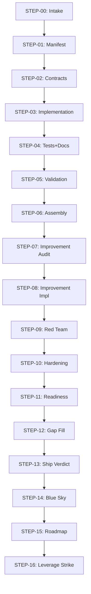

# Microservice Build Pipeline

## Purpose
End-to-end orchestration for building an L9-compliant microservice. 17 steps from intake to ship verdict. Steps 02-04 and 06-16 pending authoring — author using `templates/playbook/step.md.template`.

## Flow Diagram

## Completion Criteria
- [ ] ShipVerdictRecord.verdict == READY with empty blockers list
- [ ] All CRITICAL validation checks pass in STEP-05

## Escalation Conditions
- STEP-05 fails twice -> escalate to: Igor Beylin
- ShipVerdictRecord.verdict == BLOCKED after gap-fill -> escalate to: Igor Beylin
